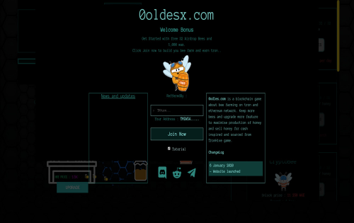

---
title: "0odlesHive"
description: "0odles的灵感来自tronhive。这个游戏是一个simu"
date: 2022-08-03T00:00:00+08:00
lastmod: 2022-08-03T00:00:00+08:00
draft: false
authors: ["whq985"]
featuredImage: "0odleshive.png"
tags: ["High risk","0odlesHive"]
categories: ["nfts"]
nfts: ["High risk"]
blockchain: "TRON"
website: "https://dappradar.com/deeplink/2848"
twitter: "https://twitter.com/dapp_com"
discord: ""
telegram: ""
github: "https://www.youtube.com/dappcom"
youtube: ""
twitch: ""
facebook: ""
instagram: ""
reddit: ""
medium: ""
steam: ""
gitbook: ""
googleplay: ""
appstore: ""
status: "Live"
weight: 
lightgallery: true
toc: true
pinned: false
recommend: false
recommend1: false
---
0odles的灵感来自tronhive。这是一款模拟蜂巢经济模式的游戏，玩家可以借此获得TRX币。日常ROI✅2.33% ~ 3.00%。✅每日空投和免费启动。✅允许每一秒取款。✅容易购买TRX。✅即时refferral索赔

**0odlesHive是一款ROI游戏。它基于TRON。该游戏的灵感来自TronHive。在0odlesHive上，您每天可以获得高达3%的投资回报率。也有推荐。**

0odles的灵感来自tronhive。该游戏是蜂巢经济模型的模拟器，因此您可以获得TRX硬币。✅2.33%~3.00%的日投资回报率。✅每日空投和免费启动。✅允许每秒退出一次。✅轻松购买TRX。✅即时反驳索赔

