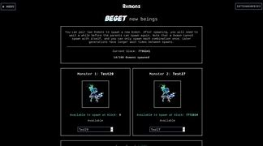

**0xmons是存在于以太坊区块链上的稀有数字收藏品。它们的灵感来自Pokemon, SCP和Lovecraft。**

**0xmons是存在于以太坊区块链上的稀有数字收藏品。它们的灵感来自Pokemon, SCP和Lovecraft。**

**每个0xmon都有一个独特的动画生成GAN(生成对抗网络)训练像素艺术图像。**

**然后将图像与来自生成语言模型(如GPT-3)的唯一名称、绰号和知识配对。**

为了确保它们持久，每个0xmon都可以完全在以太坊上进行编码。这意味着只要区块链存在，每个怪物的动画，名称，绰号和传说都可以保留。

用户可以选择更便宜的呼叫数据选项或合约存储以获得完全可用性。

