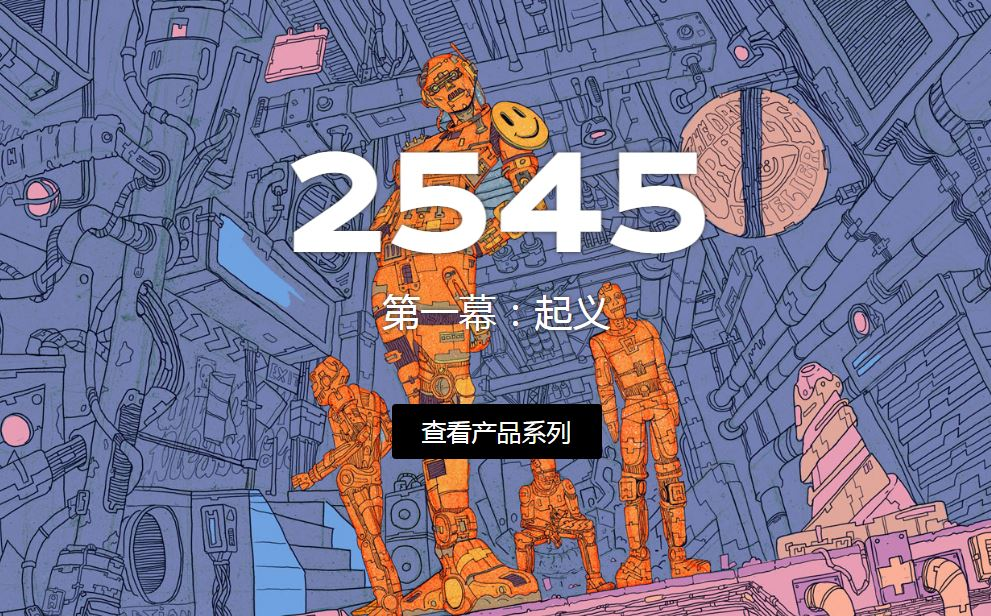

一个被三派机器人分裂的反乌托邦世界。由120个手绘特征，2545是一个生成艺术非ft集合9,999个独特的字符设置在公元2545年。2545年的反乌托邦世界中，受压迫的机器人获得了超级智能，并绕过了其创造者阿什·库罗夫博士设定的安全协议，导致了一场起义和随后的人类种族灭绝。2545个NFT的所有者将享受访问Discord服务器的内部领域，会员专属的NFT掉落，优先访问小说的发布，等等。

2545由120个手绘特征组成，是公元2545年9，999个独特字符的生成艺术NFT集合。2545年的反乌托邦世界是一个受压迫的机器人获得超级智能并绕过其创造者阿什·库罗夫博士制定的安全协议的世界，导致起义和随后对人类的种族灭绝。

