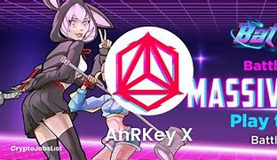

---
title: "AnRKey X"
description: "在未来基于DeFi的游戏- m$ports™中购买、玩、参与nft和竞争"
date: 2022-08-03T00:00:00+08:00
lastmod: 2022-08-03T00:00:00+08:00
draft: false
authors: ["whq985"]
featuredImage: "anrkey-x.png"
tags: ["Collectibles","AnRKey X"]
categories: ["nfts"]
nfts: ["Collectibles"]
blockchain: "ETH"
website: "https://anrkeyx.io/landing/"
twitter: "https://www.twitch.tv/anrkeyx/"
discord: ""
telegram: ""
github: ""
youtube: ""
twitch: ""
facebook: ""
instagram: ""
reddit: ""
medium: ""
steam: ""
gitbook: ""
googleplay: ""
appstore: ""
status: "Live"
weight: 
lightgallery: true
toc: true
pinned: false
recommend: false
recommend1: false
---

AnRKey X™结合了DeFi和电子竞技游戏，用户可以竞争，购买和持有独特的NFTs，并赢得宝贵的奖励。

AnRKey X™协议平台由区块链、加密资产和DeFi领域公认的全球领导者创建，是一个gDEX(去中心化金融游戏平台交易所)，旨在将DeFi、电子竞技和Web 3.0 NFTs合并为一个游戏平台，创建一个名为m$ports(金钱体育)的全新行业。AnRKey X的令牌$ANRX就像一个街机币，你购买、玩、持股、出售和竞争的越多，你在AnRKey X™游戏系统中赚取的ANRX越多。获奖团队拥有超过60年的区块链和加密、传统g

## 在战斗波2323 中玩游戏赚取加入10，000名用户，每月赚取$ 300K +

## 战斗，赌注和赢得高达350%APY的大量奖池 - 900K $ANRX  使用POLYGON网络，几乎为零的汽油费

## 超过20，000名用户加入了DEFI NFT社交游戏的未来

关于 AnRKey X AnRKey X™ 协议平台由区块链、加密资产和 DeFi 领域公认的全球领导者创立，是一个 gDEX（去中心化金融游戏平台交易所），旨在将 DeFi、电子竞技和 Web 3.0 NFT 整合到他们的游戏中平台创建了一个名为 m$ports（金钱运动）的全新行业。

